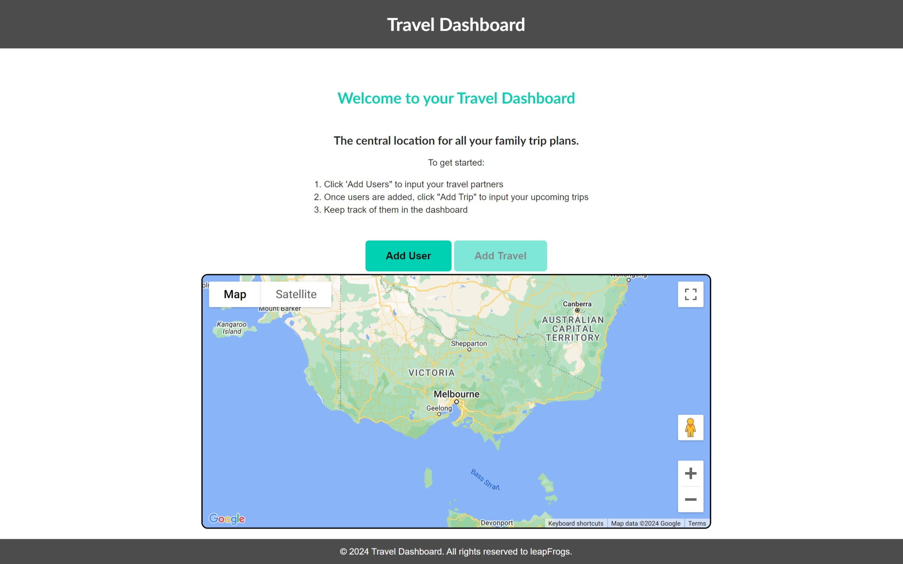

# travel-dashboard

## Description

- This application provides a travel dashboard  to manage and view the travel plans for the added users. 
- It includes building modal forms so user can add users and add travel plans.
- It includes building a dashboard displaying the list of all the travel plans created for the users along with the option to view the weather conditions of the destination and the countdown for the travel.
- The dashboard also has a visual map that shows various markers pointing the user locations and travel destinations.
- The application validates the user inputs and provides appropriate messages. The server side validations are taken care by ensuring that the user is displayed a server error page.
- The implementation of this project helped apply pur knowledge on html, css, jquery, github for repostitory management, use of third party components : jQuery UI Widgets, DayJS and Bulma CSS framework, Server side api calls.

## Table of Contents 

- [Installation](#installation)
- [User Story](#userstory)
- [Usage](#usage)
- [Acceptance Criteria](#acceptancecriteria)
- [Tests](#tests)
- [Credits](#credits)
- [License](#license)

## Installation

Follow these instructions to create your project and deploy it to GitHub Pages:

1. Create a new repository on your GitHub account and clone it to your computer.

2. When you're ready to deploy, use the git add, git commit, and git push commands to save and push your code to your GitHub repository.

3. Navigate to your GitHub repository in the browser and then select the Settings tab on the right side of the page.

4. On the Settings page, select Pages on the left side of the page. On the GitHub Pages screen, choose main in the dropdown under Branch. Click the Save button.

5. Navigate to <your-github-username.github.io/your-repository-name> and you will find that your new webpage has gone live! For example, if your GitHub username is "lernantino" and the project is "css-demo-site", then your URL would be <lernantino.github.io/css-demo-site>.


## User Story 

```md
As a family that travels frequently.
I want a dashboard that organises all our family trips, as a family and individually
So that I can see and plan if there are any trip overlaps,check the countdown for the trips, check the weather at the destination, see distances and view local activities
```

## Usage

Link for the repository : 

https://github.com/shwetakadam5/travel-dashboard

Link for the webpage : 

https://shwetakadam5.github.io/travel-dashboard/


<TODO : Update the application pages>
**Travel Dashboard Home Page :**



**Travel Dashboard Home Page : with users, trips and map markers**


**Travel Dashboard Add User Modal :**


**Travel Dashboard Add Travel Plan Modal :**


## Acceptance Criteria 

```md
GIVEN a travel dashboard to manage the travel plans
WHEN I open the travel dash board
THEN the Welcome message with options to add users, add trips and show map is displayed along with a google map.
When I open the travel dash board after users and trips are created
THEN the dashboard with all the trips is displayed.The google map is now updated with user home location markers and travel destination markers.
WHEN I view the task board for each travel/trip
THEN each travel/trip plan will have columns representing the Trip, Location, Time, Weather, down/expand icon and delete icon. Further details of the Travel partners are displayed on clicking of the down/expand icon along with activity ideas. 
WHEN I click on the button to add a new user
THEN I can enter the First Name, Last Name, Date of birth, Address, City, Country and Zip Code into a modal dialog
WHEN I click the submit button for that user
THEN the properties for that user are validated and saved in localStorage.A map marker for the user is created on the map.
WHEN I click the cancel or X button on the create new user modal, the modal dialog is closed and the dashboard is displayed.
WHEN I click on the button to add travel
THEN I can enter the Trip Name, Destination City, Travel partners, Trip Start Date and Trip End Date into a modal dialog
WHEN I click the submit button for that trip
THEN the properties for that trip are validated and saved in localStorage.A map marker for the trip is created on the map.
WHEN I click the cancel or X button on the create travel plan modal, the modal dialog is closed and the dashboard is displayed.
```

## Tests

All tests and activities were recorded and tracked in the following location : (https://trello.com/b/3LaamllG/travel-dashboard)

## Credits


- https://github.com/shwetakadam5
- https://github.com/gaylemcclure
- https://github.com/RasXBer


_Third-party assets:_

- https://bulma.io/documentation/elements/title/
- https://jqueryui.com/
- https://day.js.org/
- https://openweathermap.org/api
- https://developers.google.com/maps/documentation/javascript
- https://developers.amadeus.com/


_Tutorials :_ 

- https://developers.google.com/maps/documentation/javascript/adding-a-google-map

## License

MIT
